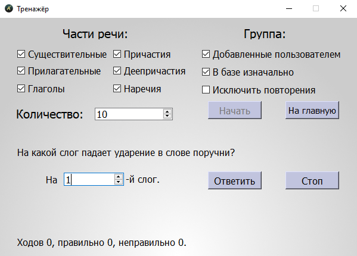

## Добро пожаловать в Ударный тренажёр!
#### Перед Вами - программа-тренажёр по самым частым случаям постановки ударения в ЕГЭ по русскому языку.

Что она умеет? Давайте посмотрим вместе.

Запуск программы - через исполняемый файл **(.exe)**, расположенный в корневой директории. Для удобства можно создать ярлык на рабочем столе.  
*Для просмотра кода в той же директории расположен **Ударный тренажёр.py***

#### Запустим программу.

Здесь расположились краткое описание программы и приятные пожелания. Смело жмём **Вперёд!** и переходим на основное окно.

Теперь перед нами - большая таблица с различными словами, в каждом из которых выставлено ударение. По умолчанию слов 230 - столько, сколько использовано в справочнике от ФИПИ для подготовки. Слова можно отсортировать по частям речи и группам, упорядочить по ID в базе, по части речи (существительные, прилагательные, глаголы, причастия, деепричастия, наречия) и по алфавиту. Для изменения отображаемых слов выбираем необходимые пункты в нижней части экрана, затем нажимаем **Применить**.

В правом верхнем углу хорошо заметны кнопки **Редактировать** и **Тренажёр** - нажав на них, попадаем в соответствующие окна. В меню **Редактора** можно добавлять новые записи и удалять старые - но только из тех, что были добавлены пользователем. Записи, изначально находившиеся в базе данных, удалить нельзя. Учтите - нельзя добавлять слова, содержащие любые символы, кроме кириллических. Программа автоматически определяет длину слова в слогах, и в случае неверной постановки ударения также уведомит пользователя. Зато неважен регистр вводимого слова - можно писать ЛюБЫм обРАЗом.

В **Тренажёре** проверяется знание ударений - из всех записей можно выбрать те, которые нужно натренировать прямо сейчас. К примеру, есть возможность расставлять ударения только в существительных и наречиях, можно отключить повторение слов в рамках одной игры. В нижней части экрана с каждым ходом будет обновляться статистика - количество ходов, счётчики правильных и неправильных ответов. При неправильном ответе программа подскажет, какое ударение в слове стоит на самом деле.

Меню **Статистика** отображает активность пользователя, количество его правильных и неправильных ответов и ответов в целом. Можно сбросить статистику по **Тренажёру**.

### Удачи в использовании!